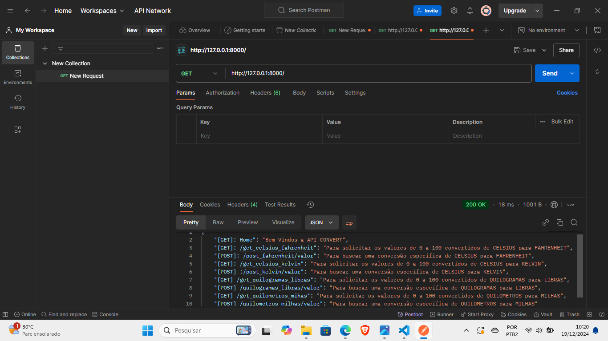
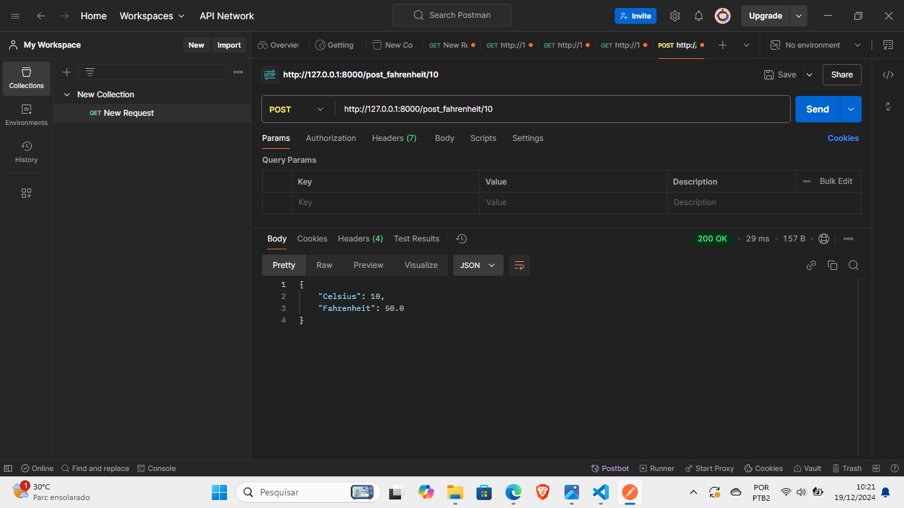
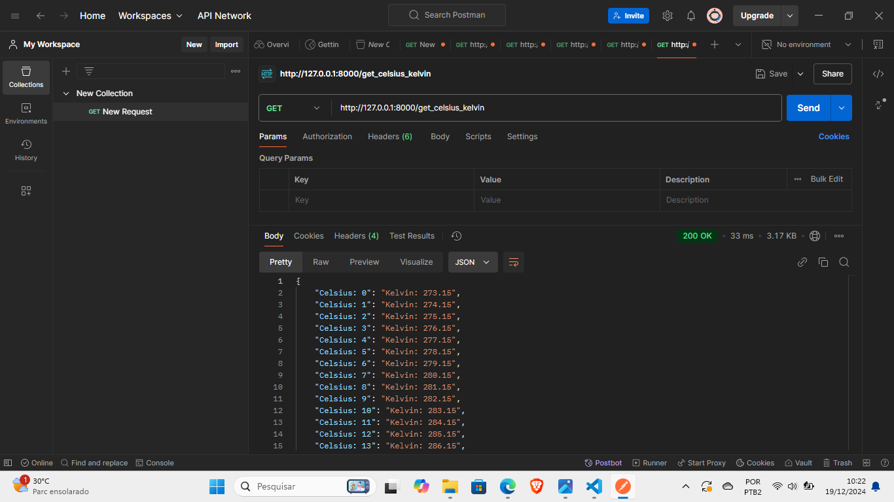
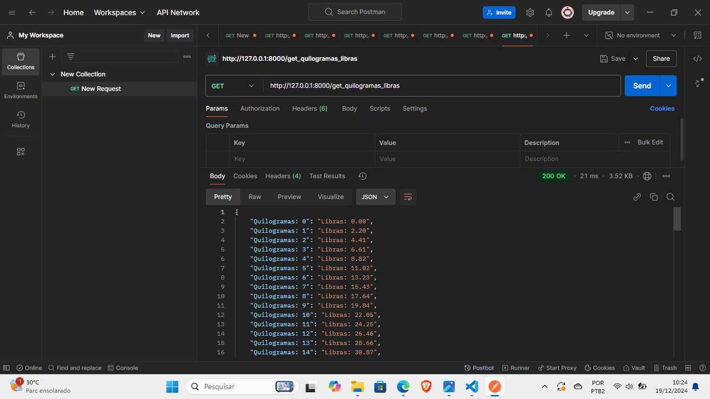
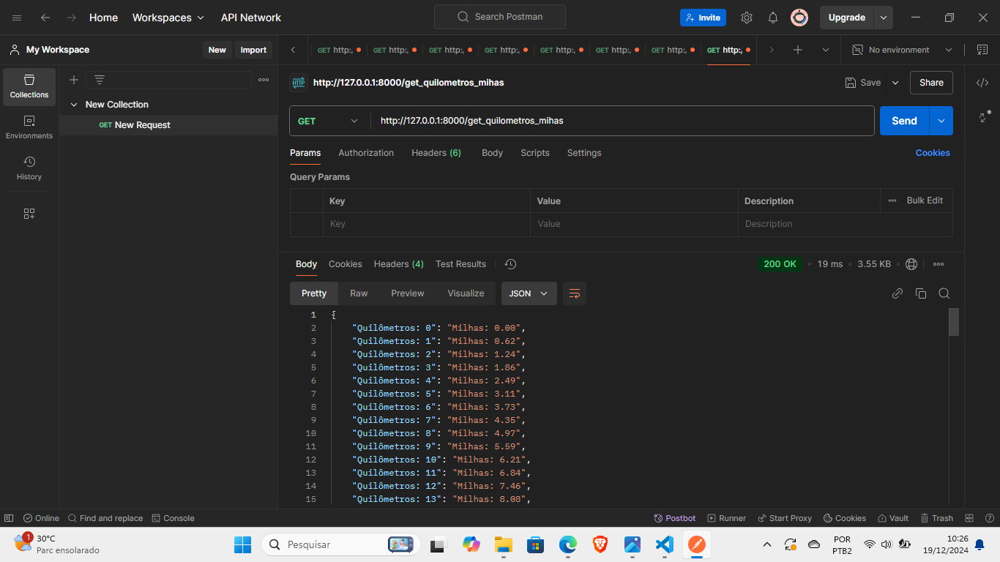
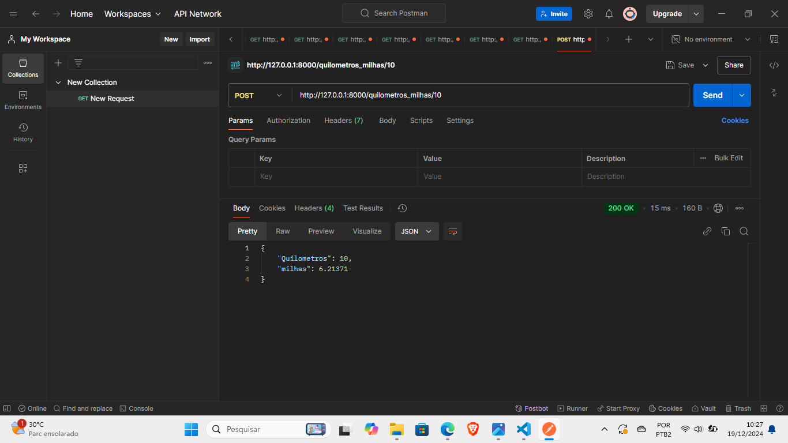

# API_CONVERSOR

API criada em FastApi para a conversão de algumas unidades de temperatura, peso e distância, com métodos GET para acessar os valores convertidos de 0 a 100, e métodos POST para converter um valor específico.

#### endpoint para acessar os valores convertidos de Celsius para Fahrenheit de 0 a 100:

#### /get_celsius_fahrenheit

#### endpoint para calcular a conversão de um valor específico de Celsius para Fahrenheit:

#### /post_fahrenheit/valor

#### endpoint para acessar os valores convertidos de Celsius para Kelvin de 0 a 100:

#### /get_celsius_kelvin

#### endpoint para calcular a conversão de um valor específico de Celsius para Kelvin:

#### /post_kelvin/valor

#### endpoint para acessar so valores convertidos de Quilogramas para Libras de 0 a 100:

#### /get_quilogramas_libras

#### endpoint para calcular o conversão de um valor específico de Quilogramas para Libras:

#### /quilogramas_libras/valor

#### endpoint para acessar os valores convertidos de Quilômetros para Milhas:

#### /get_quilometros_mihas

#### endpoint para calcular a conversão de um valor epecífico de Quilômetros para Milhas:

#### /quilometros_milhas/valor

